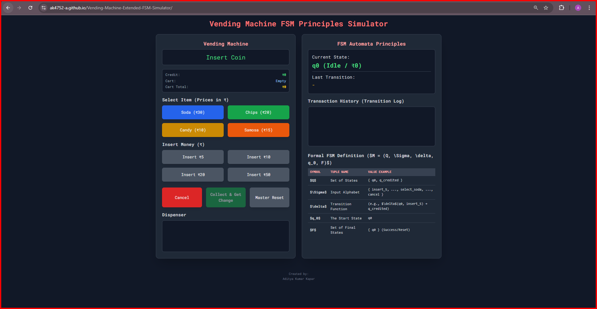
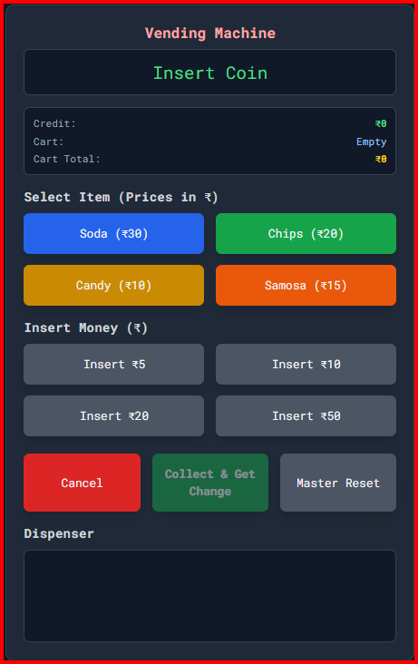
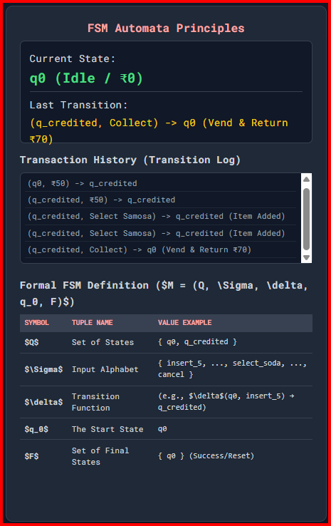
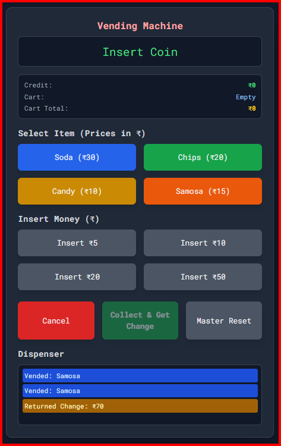

# Vending Machine Extended FSM Simulator

A browser-based simulator that demonstrates **Finite State Machine (FSM) principles** through an interactive vending machine. Built with plain HTML, CSS (Tailwind), and vanilla JavaScript — no build step required.

**🔴 Live Demo:** [https://ak4752-a.github.io/Vending-Machine-Extended-FSM-Simulator/](https://ak4752-a.github.io/Vending-Machine-Extended-FSM-Simulator/)

---

## Features

- **Credit insertion** — insert ₹5, ₹10, ₹20, or ₹50 coins
- **Item selection** — choose from Soda (₹30), Chips (₹20), Candy (₹10), Samosa (₹15)
- **Cart system** — add multiple items; the cart persists until you collect or cancel
- **Info panel** — always-visible current credit (₹), cart contents, and cart total
- **Cancel / refund** — returns all inserted money (including spent items' value) at any time
- **Collect & Get Change** — vends all cart items and returns remaining credit as change
- **Master Reset** — clears the machine and refunds any money, then resets the log
- **Transition log** — every FSM transition is recorded in a scrollable history panel
- **Accessible** — `aria-live="polite"` on the display and log so screen readers announce updates

---

## Screenshots

> Replace the placeholder images below by uploading real screenshots to the `screenshots/` folder.  
> **Guidelines:** recommended size ~1280×720 px, filenames lowercase with hyphens, PNG format preferred, keep file sizes reasonable (compress if > 500 KB).






---

## How to Run Locally

**Simplest — just open the file:**

```bash
# In your file manager, double-click index.html
# OR from a terminal:
open index.html        # macOS
xdg-open index.html   # Linux
start index.html       # Windows
```

**Optional — serve over HTTP (avoids any browser CORS restrictions):**

```bash
python -m http.server 8080
# Then open: http://localhost:8080
```

---

## FSM Overview

The simulator models a **two-state extended FSM**:

**M = (Q, Σ, δ, q₀, F)**

| Component | Description | Value |
|-----------|-------------|-------|
| **Q** | Set of states | `{ q0, q_credited }` |
| **Σ** | Input alphabet | `{ insert_5, insert_10, insert_20, insert_50, select_soda, select_chips, select_candy, select_samosa, cancel, collect, reset }` |
| **δ** | Transition function | See table below |
| **q₀** | Start / initial state | `q0` |
| **F** | Set of accepting states | `{ q0 }` (successful transaction or idle) |

### States

| State | Meaning |
|-------|---------|
| `q0` | **Idle** — machine has no inserted credit; waiting for a coin |
| `q_credited` | **Has Credit** — at least one coin has been inserted; items can be selected |

### Key Transitions (δ)

| Current State | Input | Next State | Action |
|---------------|-------|------------|--------|
| `q0` | insert coin | `q_credited` | credit += coin value |
| `q0` | select item | `q0` | display "Need ₹X" |
| `q0` | cancel / collect | `q0` | no-op |
| `q_credited` | insert coin | `q_credited` | credit += coin value |
| `q_credited` | select item (sufficient credit) | `q_credited` | add to cart, credit -= price |
| `q_credited` | select item (insufficient credit) | `q_credited` | display "Need ₹X more" |
| `q_credited` | cancel | `q0` | refund all credit + cart value |
| `q_credited` | collect | `q0` | vend cart items, return remaining credit as change |
| any | reset | `q0` | refund all money, clear cart and log |

---

## Usage Instructions

1. **Insert coins** using the "Insert Money" buttons until you have enough credit.
2. **Select an item** from the "Select Item" grid — it is added to your cart and the price is deducted from your credit.
3. Repeat step 1–2 to add more items if desired.
4. Click **"Collect & Get Change"** to vend all cart items and receive any remaining credit as change.
5. Alternatively, click **"Cancel"** at any time to refund all your money without receiving items.
6. Watch the **Transition Log** on the right to follow the FSM transitions in real time.
7. Use **"Master Reset"** to clear everything and start fresh.

---

## GitHub Pages Deployment

The site is served from the `main` branch root via GitHub Pages.

**To (re-)enable GitHub Pages on a fork:**

1. Go to your repository → **Settings → Pages**.
2. Under **Source**, choose **"Deploy from a branch"**.
3. Set **Branch** to `main` and **Folder** to `/ (root)`.
4. Click **Save**.
5. Wait ~1–2 minutes, then visit `https://<your-username>.github.io/<repo-name>/`.

---

## Author

- Aditya Kumar Kapar


---

## License

This project is licensed under the [MIT License](LICENSE).

---

## Contributing

See [CONTRIBUTING.md](CONTRIBUTING.md) for guidelines on reporting bugs, suggesting improvements, and running the project locally.
